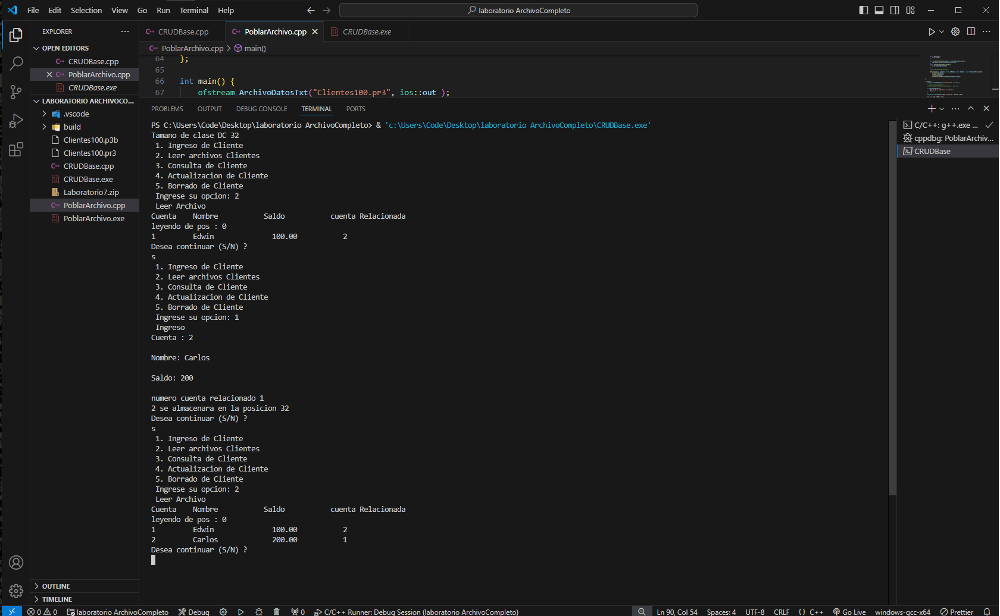

# Proyecto CRUD con Archivo Binario

Este proyecto maneja registros en un archivo binario.

## Pasos:

1. **Crear el archivo binario**: Ejecuta `PoblarArchivo.cpp` para crear el archivo binario con los datos iniciales.
   - Compilar: `g++ PoblarArchivo.cpp -o poblar`
   - Ejecutar: `./poblar`

2. **Modificar registros**: Ejecuta `crud.cpp` para modificar, agregar, eliminar o leer los registros del archivo binario.
   - Compilar: `g++ CRUDBase.cpp -o crud`
   - Ejecutar: `./crud`

# CRUD Project with Binary File

This project manages records in a binary file.

## Steps:

1. **Create the binary file**: Run `PoblarArchivo.cpp` to create the binary file with initial data.
   - Compile: `g++ PoblarArchivo.cpp -o populate`
   - Run: `./populate`

2. **Modify records**: Run `CRUDBase.cpp` to modify, add, delete, or read records from the binary file.
   - Compile: `g++ CRUDBase.cpp -o crud`
   - Run: `./crud`

